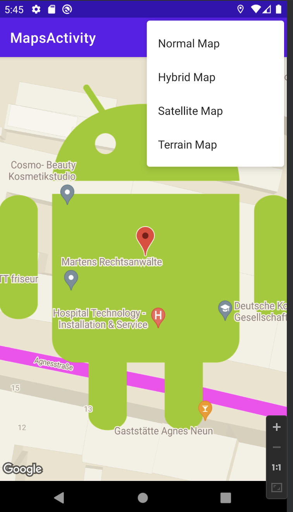

# Udacity Android Application how to use Google Maps

## Snapshot of the app

## Features
* Show google Maps
* Change between differnt maps (e.g. satellite view)
* Set and configure markers
* Set info for POIs
* change the style (e.g. street colors)
